# Sage
A custom bootstrap theme that I created as part of a SASS challenge

I decided to use a pastel color palette, as I found it easier on the eyes compared to the high constrast and saturated templates available on Bootstrap's website.
Additional styling on certain elements tied the whole theme together, and the result was a simple yet elegant custom theme.

The primary view of the theme's components, including the Bootstrap buttons and navbars
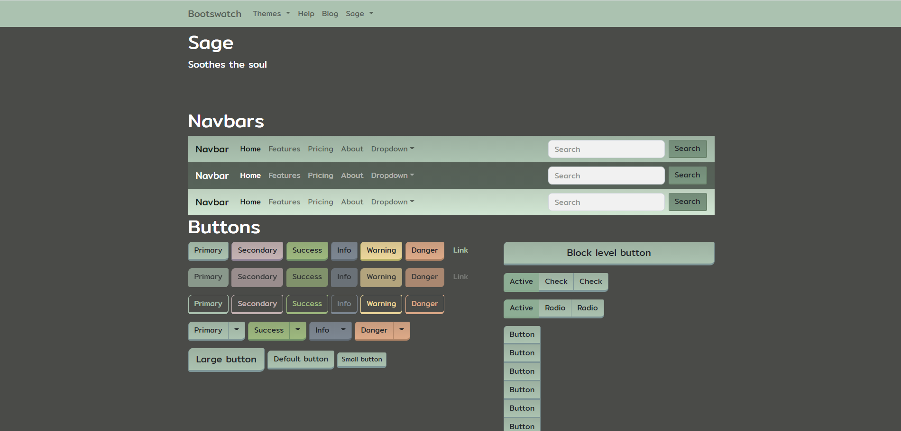

Typography using the theme's color palette and custom font
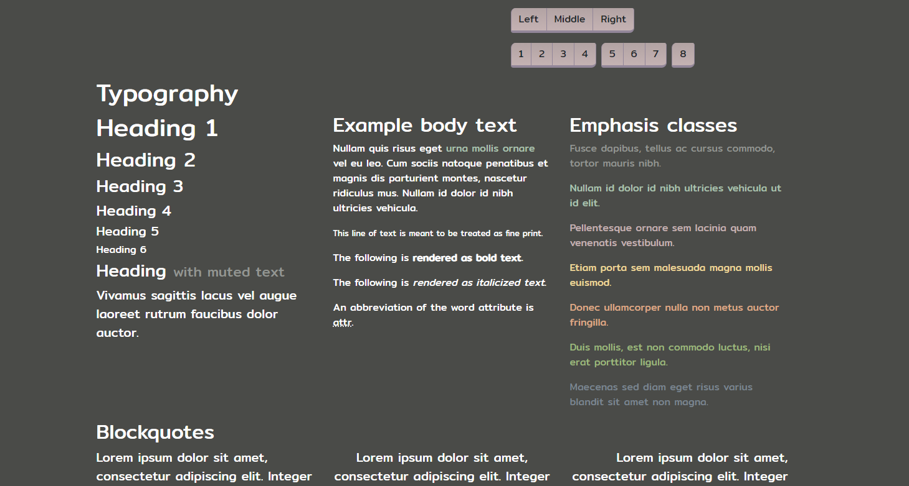

Tables using the theme's color palette
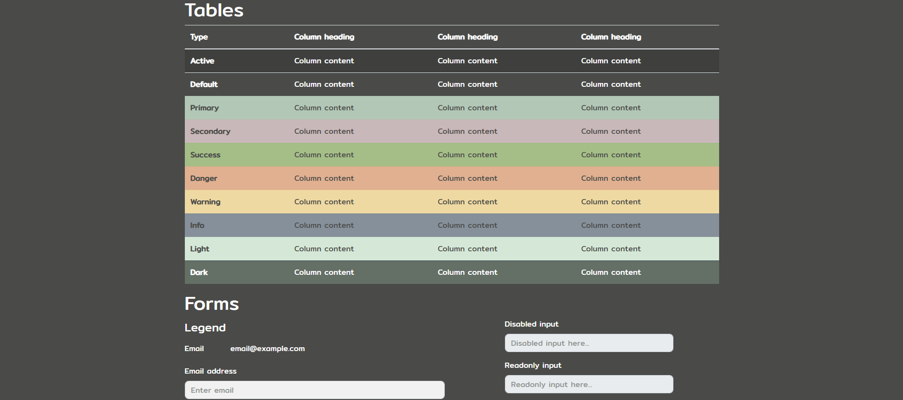

Forms using a modified valid/invalid input field, as well as custom input addon buttons
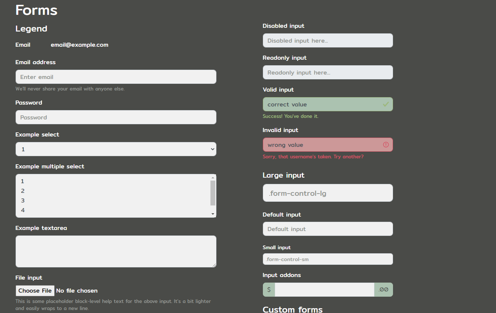

Radio buttons and custom forms, displaying the theme's color palette, buttons and font
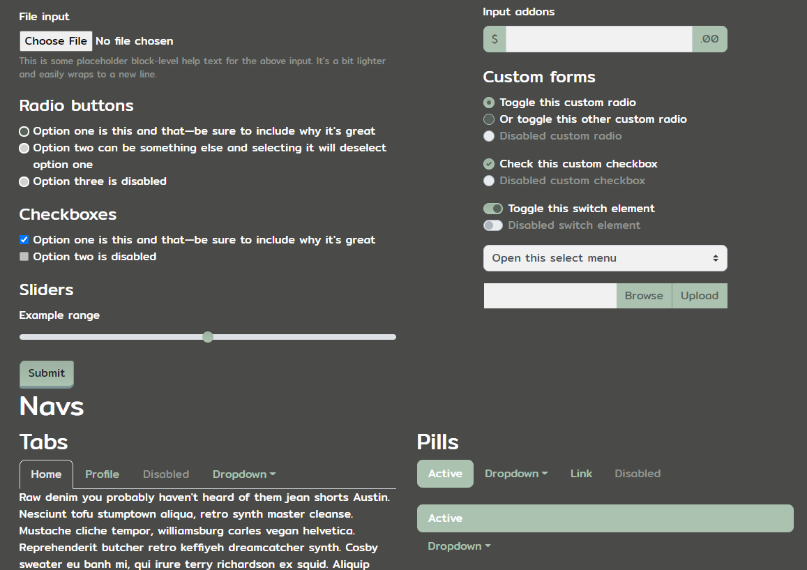

Custom breadcrumbs, pills and pagination elements
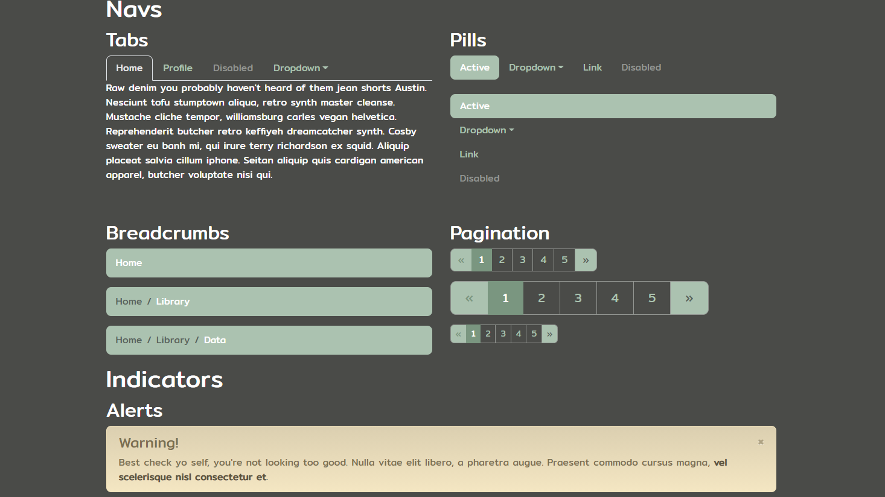

Indicators, badges and progress bars
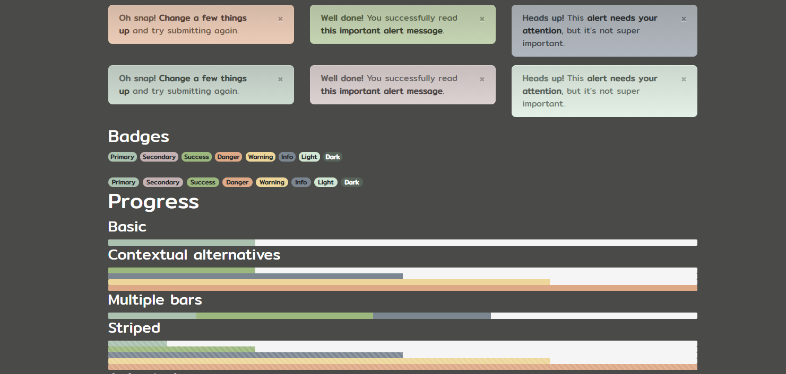

Containers and list groups
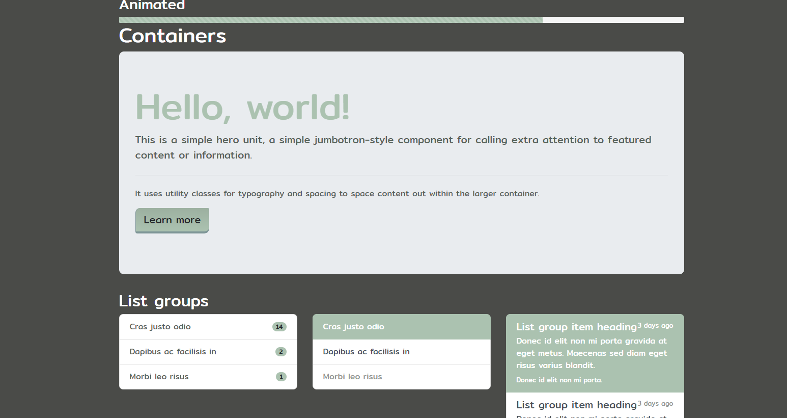

Cards pt. 1
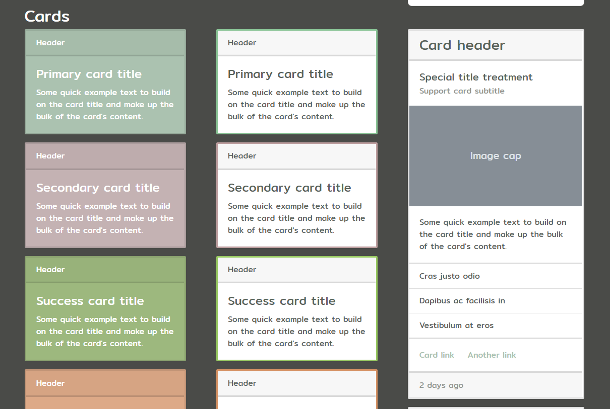

Cards pt. 2
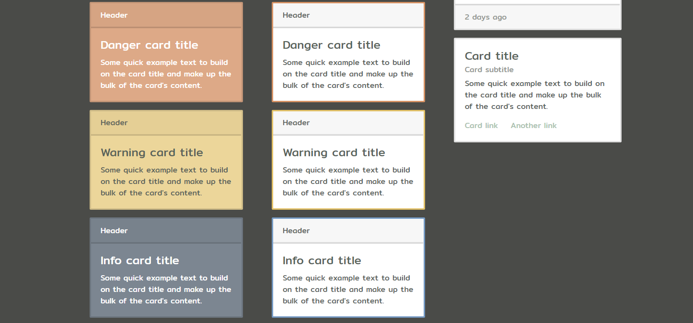

Cards pt. 3
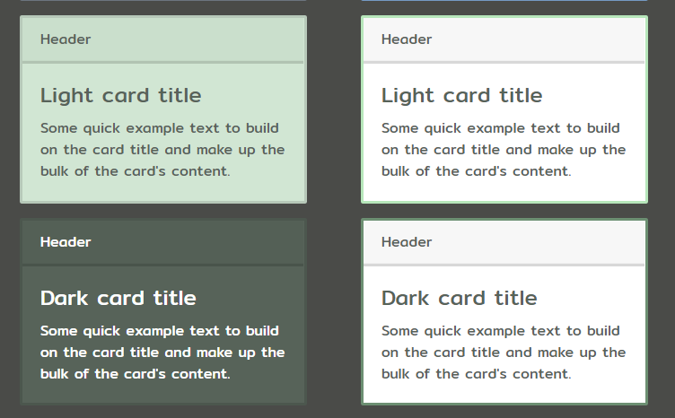
